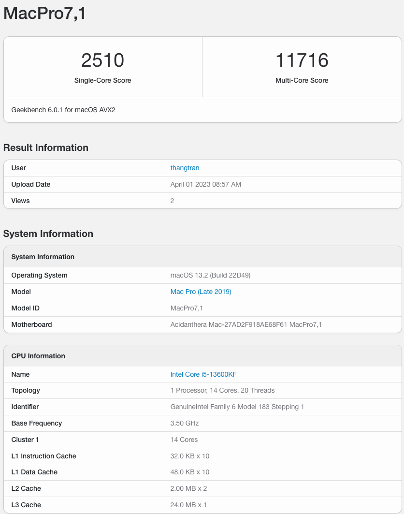

# Hackintosh for MSI MAG B660M MORTAR WIFI DDR4

### Hardware
| Components | Model |
| --- | --- |
| CPU | Intel i5 13600KF |
| Motherboard | MSI MAG B660M MORTAR WIFI DDR4 |
| Graphics card | XFX Merc 319 6900 XT LIMITED BLACK OC |
| Memory | Corsair LPX 8GB X 2 3600Hz |
| Wifi and Bluetooth card | Support onboard Wi-Fi and Bluetooth |
| Drive | SAMSUNG EVO 860 250GB - WD SN750 500GB　|
| Monitor | Dell P2419H - LG 27GL850 |
| OpenCore version | 0.9.2 |
| macOS version | macOS Ventura 13.2 (22D49) |

### Benchmark CPU Score

### Benchmark 6900XT Metal Score

## What's working?
1. Almost all.

## What's not working/issues?
1. Can not connect some bluetooth devices (can be found, but cann't pair).
2. After wake when sleep, the bluetooth not working.

## BIOS Settings
### Disable
1. Secure Boot `[Required]`
2. Intel CFG lock `[Required]`
3. Fast Boot `[Optional]`

### Enable
1. Re-Size Bar Support `[Required]`
3. ERP Ready `[Optional] used for wake up from sleep using USB HID device.`
4. SR-IOV `[Optional]`
5. RAM XMP `[Optional]`

## Generate your EFI
1. OpenCore Auxiliary Tools
2. Hackintool
3. Should disable Intel Bluetooth kexts, re-enable when installed.

## About Onboard Wi-Fi and bluetooth `[!!!Important!!!]`
This EFI already supported for onboard Wi-Fi and Bluetooth, but recommend replace native wifi cards to fully support.
If you want to use onboard Wi-Fi, please add AirportItlwm.kext. I only use Bluetooth so I removed this kext.

## Support for other AMD GPUs
This EFI supports 6000 Series AMD GPUs.

## About USB map
Maybe you need to make some changes to suit your USB and case. I using hackintool to export USBPorts.kext.

## References
1. https://github.com/yzchan/MSI-MAG-B660M-MORTAR-DDR4-12600K-EFI
2. https://chriswayg.gitbook.io/opencore-visual-beginners-guide/advanced-topics/using-alder-lake
3. https://github.com/duxphp/Hackintosh-12700KF-B660M-MORTAR-6600XT
6. https://dortania.github.io/OpenCore-Install-Guide/

